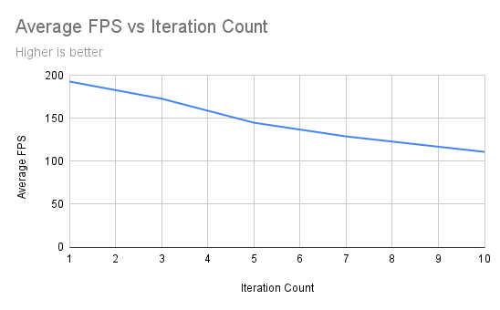
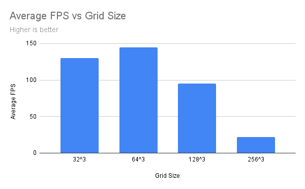
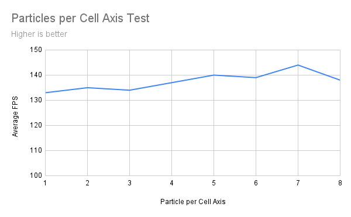
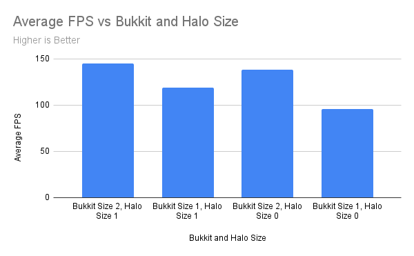

Breakpoint is a project created by Daniel Gerhardt, Dineth Meegoda, Matt Schwartz, and Zixiao Wang. The goal is to combine PBMPM, a recent particle simulation method created by EA with fluid mesh shading using another 2024 research paper so as to make the simulation work in real time. 

Initially our plan was to incorporate the Mesh Mortal Kombat paper for the voxelization and destruction of soft bodies using PBMPM particles, but the scope of the project became too large.

# Milestone Overviews

## Milestone 1

The largest development for milestone 1 was the creation of the DirectX 12 engine. The project was created from scratch, so a lot of time and effort went in to putting together a solid foundation for the rest of the project that could scale for the many pipelines and compute passes required for combing PBMPM with mesh shading fluids. Additionally, compute passes, structured buffers for GPU data passing, and initial mesh shaders were set up for this milestone.

[Presentation Slides: Milestone 1](https://docs.google.com/presentation/d/1uvDaPuCbTf3sGTrdG3B5cbSMfCqcLp-30cOSEHXo5kk/edit?usp=sharing)

## Milestone 2

During milestone 2, PBMPM and PBD were implemented. PBMPM in 2D had some issues, mainly with volume loss and grid managemement, since the grid was not properly scaled for the camera setup. PBD was implemented with face and distance constraints for voxels, but after this milestone the work was sidelined to focus on getting PBMPM set up for 3D. The compute passes for mesh fluid shading were also created, and many optimizations were added to ensure the speed and optimality of the rendering of the fluids. 

[Presentation Slides: Milestone 2](https://docs.google.com/presentation/d/13KYH3RUm3WJH41AbbYVSyAzI5QF6jys8uZgEHLffQEA/edit?usp=sharing)

## Milestone 3

For milestone 3, the 3D framework for PBMPM was created. Additionally emission and dynamic forces were added to the implementation of PBMPM, which aided in the fix for the grid bug present in milestone 2. The framework for mesh shading the fluids was completed, so all of the pieces for the finished product are in place. The setback is that there are issues with the movement of the 3D particles, and the mesh shading fluid setup needs to be adapted to have PBMPM particles as their input, which are the next steps for the project.

[Presentation Slides: Milestone 3](https://docs.google.com/presentation/d/10rVP-IElwPZj0ps3fi2w58sSem8OLQtoXfR4WyeSV_s/edit?usp=sharing)

## TODOs for Final Presentation

The last steps for the final week of the project are as follows.
- Fix volume loss and noise in 2D PBMPM
- Fix force application and up-right movement in 3D PBMPM
- Adapt fluid mesh shading to take liquid PBMPM particles as input
- Build a demo scene

# Project Overview

## DirectX Core

The DirectX core for this project is the rendering and compute framework for all the presentation and computation of the project. It was created from scratch, with help from the DX documentation, examples, and Ohjurot's tutorial series. The core includes a scene with render pipelines for mesh objects, PBMPM particles, and the fluid mesh shading pipelines. It has a movable camera for traversal through the scene, and mouse interaction to apply forces to the PBMPM particles. There are custom StructuredBuffer and DescriptorHeap classes to better interface with the DirectX API for our uses, making it easier for us to create and manage memory on the GPU. We also used ImGUI to tune the parameters in PBMPM.

## PBMPM

The public repository for PBMPM includes a 2D, non-optimized version of the simulation. We hope to expand this to 3D, and add shared memory GPU optimizations to PBMPM to make it real time in DirectX. We have had trouble setting up the grid to play well with our camera and object scale as well as volume preservation, and moving to 3D has caused some further issues with particle movement.

PBMPM works by putting particles into a grid of bukkits, allocating work per bukkit, and then enforcing movement constraints per material per bukkit. The bukkits have a halo range so the particles can react to the movement of particles within neighboring bukkits.

As of milestone 3, the 2D implementation has working bucketing, mouse movement for forces, and sand, snow, and liquid materials. In 2D gravity is applied and particles interact, but volume loss and noise are prevalent in the system. In 3D, the forces are not applied properly, and there is an unknown bug causing the particles to move up and to the right.

### Materials

Most of the materials we have are based on the original public PBMPM paper 2D materials implementations (liquid, sand, elastics, Visco). However, the snow is mainly based on Disney's work about [A material point method for snow simulation](https://media.disneyanimation.com/uploads/production/publication_asset/94/asset/SSCTS13_2.pdf). The snow material implementation combines elastic deformation (reversible) with plastic deformation (permanent) using a multiplicative decomposition approach. This creates a material that can both temporarily deform and permanently change shape. 

#### Liquid
The liquid material implementation in our MPM system combines volume preservation with viscosity control to simulate fluid behavior. The implementation is primarily based on the Position Based Fluids (PBF) approach, adapted for the MPM grid-based framework.


The main liquid update happens in the constraint solving phase:
``` 
if (particle.material == MaterialLiquid)
{
    // Simple liquid viscosity: just remove deviatoric part of the deformation displacement
    float3x3 deviatoric = -1.0 * (particle.deformationDisplacement + transpose(particle.deformationDisplacement));
    particle.deformationDisplacement += g_simConstants.liquidViscosity * 0.5 * deviatoric;

    float alpha = 0.5 * (1.0 / liquidDensity - tr3D(particle.deformationDisplacement) - 1.0);
    particle.deformationDisplacement += g_simConstants.liquidRelaxation * alpha * Identity;
}
```

### Sand

The sand implementation is based on the [Drucker-Prager plasticity model](https://dl.acm.org/doi/10.1145/2897824.2925906). 


The main update loop handles the elastic-plastic decomposition of deformation and volume preservation.

```
    // Step 1: Compute total deformation gradient
    float3x3 F = mul(Identity + particle.deformationDisplacement, particle.deformationGradient);
    
    // Step 2: Perform SVD decomposition
    SVDResult svdResult = svd(F);
    
    // Step 3: Safety clamp singular values
    svdResult.Sigma = clamp(svdResult.Sigma,
        float3(0.1, 0.1, 0.1),
        float3(10000.0, 10000.0, 10000.0));
        
    // Step 4: Volume preservation
    float df = det(F);  // Current volume
    float cdf = clamp(abs(df), 0.4, 1.6);  // Clamp volume change
    float3x3 Q = mul((1.0f / (sign(df) * cbrt(cdf))), F);  // Volume preserving target
    
    // Step 5: Elastic-plastic blending
    float3x3 elasticPart = mul(mul(svdResult.U, diag(svdResult.Sigma)), svdResult.Vt);
    float3x3 tgt = alpha_blend * elasticPart + (1.0 - alpha_blend) * Q;
```

### Visco

The Visco material model in this project represents a highly viscous, non-Newtonian fluid-like material that bridges the gap between purely elastic solids and fully fluid materials. It is intended for scenarios where you want to simulate materials that flow under prolonged stress but still maintain some structural integrity under short loading times—such as pitch, wax, or thick mud. By carefully tuning the parameters, you can achieve a range of behaviors from a slow-creeping putty to a thick slurry.


```
    // Step 1: Compute deformation gradient
    float3x3 F = mul(Identity + particle.deformationDisplacement, particle.deformationGradient);
    
    // Step 2: SVD decomposition
    SVDResult svdResult = svd(F);
    
    // Step 3: Get current volume
    float J = svdResult.Sigma.x * svdResult.Sigma.y * svdResult.Sigma.z;
    
    // Step 4: Clamp deformation within yield surface
    svdResult.Sigma = clamp(svdResult.Sigma,
        float3(1.0 / yieldSurface, 1.0 / yieldSurface, 1.0 / yieldSurface),
        float3(yieldSurface, yieldSurface, yieldSurface));
    
    // Step 5: Volume preservation
    float newJ = svdResult.Sigma.x * svdResult.Sigma.y * svdResult.Sigma.z;
    svdResult.Sigma *= pow(J / newJ, 1.0 / 3.0);
    
    // Step 6: Update deformation gradient
    particle.deformationGradient = mul(mul(svdResult.U, diag(svdResult.Sigma)), svdResult.Vt);
```

### Elastic

The Elastic material in this project simulates a solid-like material that deforms under load but returns to its original shape once forces are removed, analogous to rubber or soft metals (in their elastic range). It is the simplest and most fundamental of the material implemented, serving as a baseline for understanding more complex behaviors like plasticity or viscosity.


Unlike plastic or granular materials, the Elastic material does not accumulate permanent changes. Once the external force or displacement is removed, the elastic material returns to its initial state. If you stretch it and let go, it rebounds. So there is no need to update and accumulate the deform shape, the main update loop is in the particles update section.
```
    // Step 1: Compute deformation gradient
    float3x3 F = mul(Identity + particle.deformationDisplacement, particle.deformationGradient);
    
    // Step 2: SVD decomposition
    SVDResult svdResult = svd(F);

    // Step 3: Volume preservation
    float df = det(F);
    float cdf = clamp(abs(df), 0.1, 1000.0);
    float3x3 Q = mul((1.0 / (sign(df) * cbrt(cdf))), F);
    
    // Step 4: Combine rotation and volume preservation
    float alpha = elasticityRatio;
    float3x3 rotationPart = mul(svdResult.U, svdResult.Vt);
    float3x3 targetState = alpha * rotationPart + (1.0 - alpha) * Q;
    
    // Step 5: Update displacement
    float3x3 invDefGrad = inverse(particle.deformationGradient);
    float3x3 diff = mul(targetState, invDefGrad) - Identity - particle.deformationDisplacement;
    particle.deformationDisplacement += elasticRelaxation * diff;
```

### Snow

The Snow material model is based on the elastoplastic framework described in [Stomakhin et al. 2013, A Material Point Method for Snow Simulation](https://media.disneyanimation.com/uploads/production/publication_asset/94/asset/SSCTS13_2.pdf). This model treats snow as a porous, elastoplastic medium that resists deformation elastically up to certain critical thresholds, after which it undergoes permanent (plastic) rearrangements. The approach enables simulating both firm, rigid snowpacks and flowing avalanches within a unified formulation.


Unlike purely elastic materials, snow undergoes permanent changes when overstressed. The deformation gradient F is multiplicatively decomposed into elastic (Fe) and plastic (Fp) components:

* Elastic Component (Fe): Captures recoverable deformations. When loads are removed, Fe tends toward the identity, restoring the material to its original shape (as long as the deformation stays under critical thresholds).
* Plastic Component (Fp): Records permanent rearrangements of the snow’s internal structure. Changes in Fp are not reversed upon unloading, reflecting crushed bonds or irreversibly compacted microstructure.

```
    // Step 1: SVD decomposition of deformation gradient
    SVDResult svdResult = svd(particle.deformationGradient);

    // Step 2: Elastic bounds
    float3 elasticSigma = clamp(svdResult.Sigma,
        float3(1.0f - criticalCompression, 1.0f - criticalCompression, 1.0f - criticalCompression),
        float3(1.0f + criticalStretch, 1.0f + criticalStretch, 1.0f + criticalStretch));

    // Step 3: Volume-based hardening
    float Je = elasticSigma.x * elasticSigma.y * elasticSigma.z;
    float hardening = exp(hardeningCoeff * (1.0f - Je));

    // Step 4: Elastic-plastic decomposition
    float3x3 Fe = mul(mul(svdResult.U, diag(elasticSigma)), svdResult.Vt);
    float3x3 FeInverse = mul(mul(svdResult.U, diag(1.0 / elasticSigma)), svdResult.Vt);
    float3x3 Fp = mul(particle.deformationGradient, FeInverse);
```
## Fluid Mesh Shading

We use a novel approach for constructing the fluid surface's polygonal mesh, via a GPU-accelerated marching cubes algorithm that utilizes mesh shaders to save on memory bandwidth. The specific approach follows [this paper](https://dl.acm.org/doi/10.1145/3651285), which introduces a bilevel uniform grid to scan over fluid particles from coarse-to-fine in order to build a density field, and then runs marching cubes per-cell, but in reference to the coarse groupings in order to save on vertex duplication.

As of milestone 2, we still have a few bugs to work out in the 6-compute pass (+ mesh shading pass) implementation. But we're very, *very* close! One complete, we can show off our implementation by loading in the particle position data from alembic files in the paper's github repository. Finally, we can use this fluid mesh shading technique to render the PBMPM-simulated fluid.

In the course of implementing this paper, we found many opportunities for significant performance improvements based on principle concepts taught in CIS 5650. To name a few, without going into too much detail:
1. The paper iterates over 27 neighboring cells in each thread, while constructing the uniform grid, but via complex flow-control logic, eliminates all but 8. We found a more efficient way to iterate over those 8 neighbors directly.
2. In two compute passes, the paper uses an atomic operation per thread to compact a buffer. This can be done more efficiently via stream compaction. Rather than a prefix-parallel scan, we opted to use a wave-intrinsic approach that limits atomic use to 1-per-wave.
3. In one of the more expensive compute passes, the paper again iterates over neighbors and performs many expensive global memory accesses in doing so. We implemented a shared-memory optimization to remove redundant global access.
4. Rather than resetting buffers via expensive memcpy, we are using compute shaders to reset them, avoiding the CPU-GPU roundtrip cost.
5. The paper uses one-dimensional compute dispatches; this necessitates the use of expensive modular arithmetic to calculate indices and can be avoided with three-dimensional dispatch.
7. And an assortment of smaller optimizations and fixes to undefined behavior used in the paper.

## PBD Voxelization

The Mesh Mortal Kombat paper focuses on using PBD particles to seperate a mesh into pieces that can break apart like a realistic soft body. This works by enforcing distance constraints within the voxels and face to face constraints between them. We initially wanted to use PBMPM particles to cause the destruction of the soft body materials. However, as the project progressed and we hit milestone 2, we realized it was not realistic to get a working PBMPM and PBD integration. This is largely caused because there is not much detail on the math behind the constraints and approach used for the soft body destruction. We decided it was best to focus our time on a solid PBMPM rendering rather than trying to work out the details of the soft body destruction.

# Performance Review

## PBMPM

There are a number of parameters that affect how PBMPM performs, due to the complexity of the simulation algorithm. The following is a list of performance tests for PBMPM, analyzing the various parameters and attributes of the particle simulation. For the setup, unless otherwise stated the iteration and substep count are 5, the grid is 64x64x64, there are 2000 particles emitted by an initial emitter, mesh shading is on, the particles per cell axis is 4, and the fixed point multiplier is 7.

The primary 2 are the iteration count and substep count. The substep count runs bukkiting and emission as well as g2p2g for each update within a frame. The iteration count is a subroutine of substep count that determines how many times g2p2g is run within each substep. The two of these have major impacts on performance.




These parameters, along with many others that are tied to the simulation, are at the user's discretion to choose between performance, stability, and accuracy. Having a higher iteration and substep count will increase the stability and accuracy at the cost of performance. A nice sweet spot is what we used for our basic testing setup.


The simulation has an expected albeit high falloff in performance as particle count increases. The large memory overhead creates a big disparity in performance between high and low particle counts. This is the biggest determining factor in performance, because the number of dispatches is based in thef number of bukkits containing particles.



The grid size performance is connected to the number of bukkits within the grid. Generally as the grid grows, performance decreases, but due to the limit of memory in the 3d implementation, the grid could not be stably tested past 256x256x256. 32x32x32 is likely slower than 64x64x64 because it is more likely particles were reaching edge conditions and causing branching behavior due to border friction.


Grid dispatch size is the dispatch size for any compute shader that runs per grid cell. It didn't have a noticable performance impact outside the margin of error, and the simulation did not function when the grid dispatch was not between 4 and 10.


Particle dispatch size, similarly to grid dispatch, is the disaptch size for any compute shader that runs per particle. Performance decreased when particle dispatch size increased. This was a marginal decrease. It is likely caused by larger workgroups increasing the number of threads within a single workgroup that need to access memory.



Particles per cell axis is for 2 things. The first is the volume calculation, capping out how much volume can be allotted within a cell to the particles. The second use is emission - the amount of particles per cell axis is tied to the amount of cells emitted per axis. This did not affect performance past the margin of error, as the computations involved in the two use cases are both equally performant regardless of the value of particles per cell axis.



Bukkit size and bukkit halo size determine the size of the cells that particles are grouped into and how far particles can look around them to determine the influence of surrounding cells respectively. Due to the constraints of memory usage in 3D, the 4 configurations above are the only viable ones that allow the shaders to run. This is due to the shared memory limitation of DirectX 12, which is 32kb in compute shaders. Decreasing the bukkit size increases performance, as does bukkit halo size. The halo size has a greater effect, which is expected since the halo size increase causes a vast increase in the memory access of each thread. However, it is not advised to reduce these past 2 for bukkit size and 1 for halo size, since the simulation does not perform stably below these values. Ideally, these values could be increased, but because of shared memory limitations, they cannot be in the current implementation. One avenue of investigation is determining whether a greater bukkit size with no shared memory would yield performance improvements.

## Fluid Mesh Shading

Helpful resources: 
- [PBMPM](https://www.ea.com/seed/news/siggraph2024-pbmpm)
- [Fluid Mesh Shading](https://dl.acm.org/doi/10.1145/3651285)
- [Disney Snow](https://media.disneyanimation.com/uploads/production/publication_asset/94/asset/SSCTS13_2.pdf)
- For the DX12 basics and compointer class, we used this great tutorial series resource: https://github.com/Ohjurot/D3D12Ez
